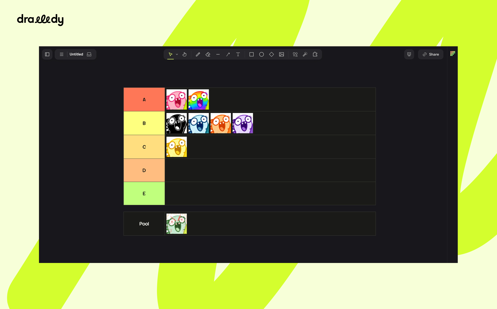

# Tier Maker for Drawdy

Build tier lists right on your Drawdy board. Design the rows in the side
panel, drop your images into the pool, and drag them onto a tier. Whatever you
drop on a row snaps into place, the row grows to fit, and the rows below move
down, the way tiermaker.com works, on your own canvas.

## What you get

- Tier rows with editable labels and colours, up to 12 of them.
- A **Pool** row under the tiers where new images wait to be ranked.
- Drag to rank: drop an image on a tier and it files itself in at the spot you
  dropped it.
- Rows that grow and shrink to fit, moving the rows below with them.
- Lists that move as one piece, ranked images included.
- Round-trip editing: select a list you placed earlier, change its tiers, and
  keep everything already ranked.

## Install

Tier Maker ships as a single file, `drawdy-tiermaker.drawdyx`. Install it in
Drawdy and the Tier Maker icon appears at the top right of the board.

The first time it needs to, Drawdy asks you to grant three permissions:
`dom` for the button and panel, `scene` for drawing on the board, and
`storage` for remembering your tier design between sessions.

## How to use

### 1. Open the panel

Click the Tier Maker icon at the top right of the board. The panel opens with
the default tiers, S through F. You can close and reopen it at any time; it
keeps its state.

### 2. Design the tiers

Every row in the **Tiers** section is one tier:

- Click the colour swatch to pick that tier's colour.
- Type in the text box to rename it (up to 24 characters).
- Use the up and down arrows to reorder tiers.
- Click **×** to remove a tier. The last remaining tier cannot be removed.
- Click **+ Add a tier** to append one, up to 12 tiers.

Your design is saved as you edit and comes back the next time you open the
panel.

### 3. Create the table

Click **Create Table**, or press `⌘ Enter` (`Ctrl Enter` on Windows/Linux)
while the panel is focused. The list lands in the middle of your current view
with a **Pool** row beneath the tiers, and is selected so the panel is already
editing it.

### 4. Add images

Drop image files onto **Drop images here**, or click it to pick files. They
are added to the pool of the selected list, scaled to the list's image height
so they line up from the start.

If no list is selected the images still find a home: with one list on the
board they go to that list, with several they go to the one nearest the
centre of your view, and with none at all they are laid out loose in the
middle of the view, ready to be dragged onto a list later.

Up to 60 images per drop, up to 16 MB each.

### 5. Rank

Drag an image out of the pool and drop it on a tier. It snaps into the row at
the position where you let go: drop it between two images and it goes between
them. The row grows if it needs another line, and the rows below shift down.

- Drag an image onto a different tier to move it there.
- Drag an image off the list entirely to unrank it. The row it left closes
  the gap.
- Select several images and drag them together. Each one is filed by where it
  lands.
- Images that are not part of the list yet (dropped loose on the canvas, or
  already on the board) join the pool first when you drop them anywhere on
  the list. Rank them from there.
- Any board element works, not only images.

### 6. Move and resize

- Drag any part of the list, a label or a row, to move the whole list. The
  ranked images travel with it.
- Drag an image's handles to resize it. When you let go, its row re-flows
  around the new size, growing or shrinking to fit, and the rows below move
  with it.

### 7. Edit a list you already placed

Click any part of a list to select it. The panel loads its tiers, shows how
many items sit in each, and the button becomes **Update Table**. Change what
you like, then click **Update Table**: the list is redrawn in place, keeping
its position and everything ranked in it. Items in a tier you removed drop
down to the pool.

Two more buttons unlock while a list is selected:

- **Fit images to image height** rescales every ranked image to the list's
  image height. Use it for images that arrived at another size.
- **Send everything back to the pool** unranks every item without deleting
  anything.

Click empty canvas to deselect, and the button goes back to **Create Table**
so you can place another list.

## Cheat sheet

| You do                                  | What happens                                        |
| --------------------------------------- | --------------------------------------------------- |
| Click the Tier Maker icon               | Opens the panel                                      |
| **Create Table** or `⌘`/`Ctrl` + `Enter` | Places a new list at the centre of the view          |
| Drop image files on the panel           | Adds them to the pool, sized to the list             |
| Drop an image on a tier                 | Files it into that tier where you dropped it         |
| Drop it between two images              | Inserts it there instead of at the end               |
| Drag an image off the list              | Unranks it; the row closes the gap                   |
| Drag any part of the list               | Moves the whole list, images included                |
| Resize a ranked image                   | Its row re-flows once you let go                     |
| Select a list                           | Loads it into the panel for editing                  |
| **Update Table**                        | Redraws the selected list in place                   |
| **Fit images to image height**          | Rescales every ranked image to one height            |
| **Send everything back to the pool**    | Unranks everything, deletes nothing                  |

## Limits and defaults

| Setting          | Value                                 |
| ---------------- | ------------------------------------- |
| Tiers            | 1 to 12                               |
| Tier label       | up to 24 characters                   |
| Images per drop  | 60                                    |
| Image file size  | 16 MB each                            |
| List width       | 1040 canvas units                     |
| Row height       | 96 canvas units minimum, grows to fit |
| Image height     | 84 canvas units                       |

## Tips

- Images are moved into place, never copied or re-created, so undo works like
  any other move on the board.
- Rows only redraw when their height changes, so ranking into a half-empty
  row touches nothing but the image you dragged.
- Resizing an image with its handles is fine; the row simply flows around the
  new size. Use **Fit images to image height** when you want everything back
  to one uniform height.
